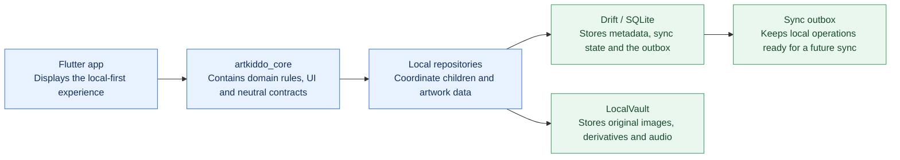

# ArtKiddo

ArtKiddo is an offline-first Flutter foundation for preserving children's
artwork. It runs locally, without an account, configuration, or network
access. Photos, metadata, voice notes, and recoverable local deletion remain
available when no remote capability is installed.

This repository is source-available under
[PolyForm Noncommercial 1.0.0](LICENSE.md). It is not an open-source project.

## What is in this repository

```text
app/                         Account-free Flutter application shell
packages/artkiddo_core/
  lib/src/domain/            Domain values and typed results
  lib/src/local/             Drift persistence, device vault, audio, repositories
  lib/src/contracts/         Vendor-neutral remote capability interfaces
  lib/src/sync/              Durable outbox and conflict primitives
  lib/src/presentation/      Capability-gated local Flutter UI
docs/                        Architecture, decisions, and agent instructions
```

The public package has no provider SDK, remote URL, credential, backend schema,
or monetization code. `app` composes `AppCapabilities.local`, so it never
touches an optional remote service.

## Local architecture



The public repository stops at the neutral contracts. It does not know which
account system, backend, database server, or object storage a consuming app may
add later.

## Optional integrations

The local application is the product baseline. An integrating application may
add optional features by implementing the public contracts and passing those
implementations at its composition root:

```text
application composition
  ├─ implements SyncBackend       ← metadata sync and remote mutations
  ├─ implements ObjectUploader    ← opaque object-key upload
  ├─ implements ObjectDownloader  ← authorized object-key download
  └─ enables explicit capabilities
             ↓
artkiddo_core
  domain + local database + local vault + vendor-neutral contracts
```

`SyncBackend` transports domain records; `ObjectUploader` and
`ObjectDownloader` deal only in bytes and opaque object keys. Their API makes
no assumption about a database, object store, authentication system, or cloud
vendor. The public core does not silently change between local and remote
behavior: the application composition must enable a capability and supply
every required adapter before any remote call is reachable.

## Run locally

```sh
flutter pub get
flutter run -d <device> --target app/lib/main.dart
```

No environment file, account, database, or storage service is required.

## Verify a change

```sh
flutter analyze
(cd packages/artkiddo_core && flutter test)
(cd app && flutter test)
dart run tool/generate_inventory.dart --check
```

Read [docs/agents/feature-workflow.md](docs/agents/feature-workflow.md) before
adding a feature and [docs/agents/public-code-rules.md](docs/agents/public-code-rules.md)
before changing the public surface.

## Contributing

See [CONTRIBUTING.md](CONTRIBUTING.md). Contributions require the
[Contributor License Agreement](CLA.md), which grants the project the right to
use and commercially relicense contributed material.
