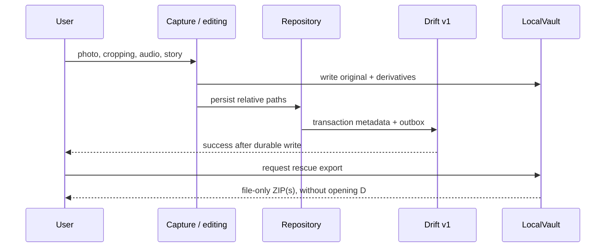

# Current public architecture

Snapshot status: public, offline-first foundation, now hosting the full
account-free gallery experience (feed, capture, sharing, and household UI
behind capability gates). This document is the entry point for a fresh
conversation; read it before scanning the source tree.

Verified on: 2026-09-20 — HEAD `af37943a20775fa314872205d4cf6d36105c8e58`
(parent of the clean-name-baseline documentation commit)

## Repository shape

```text
app/                              local Flutter composition and native shells
packages/artkiddo_core/
  lib/src/domain/                 domain values, failures, typed results
  lib/src/contracts/              vendor-neutral optional remote interfaces
  lib/src/local/                  Drift, local vault, audio, repositories
  lib/src/sync/                   sync engine, durable outbox, conflict utilities
  lib/src/presentation/
    bootstrap/                    ArtKiddoBootstrap, composition validation
    config/                       AppCapabilities, CloudServices, environment
    navigation/                   AppShell, CompositionActions seam
    gallery/                      feed, capture, artwork detail
    sharing/                      web gallery-link screens and controller
    family/                       household screens and controller
    children/, settings/, ui/, theme/, locale/, utils/
  test/                           local persistence, sync, and presentation tests
docs/                             ADRs, operating rules, generated inventory
```

`app/lib/main.dart` creates only `AppCapabilities.local`. It does not require
an account, environment values, network, database server, or object storage.

## Visual overview — local application


This separation keeps the application usable and testable without an account,
configuration, or network. Optional contracts remain abstract and contain no
provider or protocol details.

## Composition seam

`ArtKiddoBootstrap.createContainer` builds the provider graph from an
`ArtKiddoBootstrapConfig` (`capabilities`, `cloudServices`, `environment`,
`overrides`), then validates it twice:

1. `config.validate()` checks the *declared* configuration — a capability
   cannot be enabled without its required `CloudService`.
2. `_validateComposition` checks what the `overrides` *actually produced* —
   reading `compositionActionsProvider`, `remoteMediaFetcherProvider`,
   `familyApiProvider`, and `sharingServiceProvider` after construction, and
   rejecting the container if an enabled capability has no real binding
   behind it.

This second check exists because the first cannot see a composition that
enables a capability and then forgets to override its provider — that
combination used to start normally and degrade into a hidden control or a
no-op service, which is the silent local/remote fallback the architecture
forbids (ADR 0003).

Every optional provider the core declares (`remoteMediaFetcherProvider`,
`familyApiProvider`, `sharingServiceProvider`, `compositionActionsProvider`)
defaults to an honest local implementation — `NoRemoteMediaFetcher`,
`NoFamilyApi`, `NoSharingService`, `CompositionActions.none` — none of which
fabricate remote state. `NoFamilyApi`/`NoSharingService` throw or return a
typed `ActionFailed` failure rather than a fake success; `CompositionActions`
simply renders nothing when an action is null. An application composition
overrides exactly the providers its enabled capabilities need.

## Dependency direction

```text
presentation → domain / contracts → local repositories → database + local vault

application composition → public contracts and core
external implementation → public contracts only
```

The core has no dependency on an external repository. Optional behavior is
explicit: an application composition supplies compatible implementations and
enables the matching capability before a provider is read.

The rescue export is local-only: it reads vault files and never opens or
reconstructs the database.

## Local persistence

`AppDatabase` is Drift schema v1, a deliberate clean baseline. Its physical
tables are `children`, `artworks`, `sync_outbox`, `vault_meta`,
`pending_file_cleanups`, and `share_link_url_cache`. `ChildrenTable` and
`ArtworksTable` persist the account-free experience. The artwork table stores
neutral opaque object keys only (`display_object_key`, `thumbnail_object_key`,
`audio_object_key`); their meaning and lifecycle belong to an external
implementation. There is no upgrade path from an earlier local vault: those
databases are unsupported and must be cleared before running this build.

`LocalVault` owns local image and audio files. Local deletion is recoverable for
30 days and cleanup is journaled. Local success is reported only after a durable
write.

`VaultRescueExport` walks `artworks/`, `artworks_derivatives/` and `audio/`,
optionally adds in-flight capture files, splits ZIPs around 3.5 GB, and shares
the archives through the native share sheet. It can recover originals even when
`AppDatabase` is unreadable; in return, the archive contains no child, date, or
story metadata because that information lives in SQLite. The single schema
snapshot `drift_schemas/drift_schema_v1.json` pins the baseline shape.

## Key local flows



After the durable transaction, `CompositionActions.onArtworkSaved` is an
optional neutral callback. The core invokes it best-effort and never waits for
it, so a cloud composition can schedule remote work without making local save
success depend on a provider or network.

## Public contracts

- `SyncBackend` models remote metadata synchronization with typed values.
- `ObjectUploader` / `ObjectDownloader` move bytes through opaque object keys.
- `RemoteMediaFetcher` fetches media that exists remotely but not yet locally;
  the local default never fetches anything.
- `FamilyApi` models household membership and invites. `redeemInvite`'s
  `discardPrevious` and `RedeemOutcome.sameFamily`/`vaultReset` (ADR 0015)
  let a composition leave, and if orphaned purge, a previous family in the
  same server call as joining a new one — the local vault can only ever be
  bound to one family at a time, so `familyVaultResetProvider` (no-op by
  default, alongside `familyConvergenceProvider`) is where a composition
  plugs in how to erase it first. `FamilyInviteScreen`'s `_JoinFamilyDialog`
  is the only path into `FamilyController.redeem`: a read-only local bilan,
  then an explicit checkbox-gated confirmation, before either code path
  touches anything. `removeFamilyMember`/`updateFamilyMemberRole` are
  implicitly scoped to the caller's own family, like every other method on
  this contract, and are administered from an application composition's own
  family-settings UI, not from `FamilyInviteScreen` itself — that screen is
  deliberately limited to the invite/join surface, which is why `NoFamilyApi`
  throws `HouseholdUnavailableException` for both like every other member.
- `SharingService` models web gallery-link creation, listing, and revocation.
- `ShareBackup` is an optional presentation action supplied by an application
  composition when gallery links are enabled. The share controller invokes
  it for one child, then checks that child's persisted artwork sync state before
  allowing link creation. The bootstrap rejects a web-link composition without
  this action. Link visibility is evaluated against an injectable clock and
  excludes revoked and expired links.
- `CompositionActions.onArtworkSaved` is the corresponding post-commit seam for
  provider-specific upload scheduling; it has no effect in the local
  composition and does not change the local save result.

Contracts intentionally do not name a database, object store, endpoint,
authentication system, transport, or remote payload format.

## Freshness protocol

1. Run `git status --short` and `git rev-parse HEAD`.
2. If the verified date is recent and architecture-sensitive files are clean,
   trust this map and inspect only files relevant to the task.
3. If a change affects composition, contracts, schema, provider boundaries, or
   top-level layout, update this file and relevant ADRs in the same change.
4. Run `dart run tool/generate_inventory.dart`; never hand-edit its output.

## Rules that must remain true

- The local application works without account, configuration, or network.
- Public code contains no provider SDK, credentials, remote identifier, wire
  parser, or monetization.
- There is no implicit fallback between remote and local authority — enforced
  both by capability gating in the UI and by `_validateComposition` at boot.
- A feature is not complete until its local behavior, optional capabilities,
  compatibility impact, and rollback are stated.

## Publication note

Package distribution is independent from the internal architecture.
This documentation describes only the code in this repository; integrating
applications must provide their own compositions and implementations of the
optional contracts.
