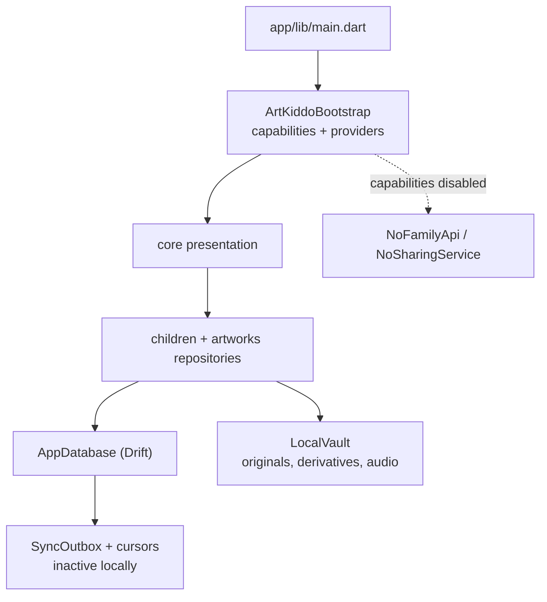

# Current public architecture

Status: public, offline-first foundation hosting the full account-free gallery
experience (feed, capture, sharing and household UI behind capability gates).
Read this before scanning the source tree.
Verified on: 2026-09-24 (gallery and artwork screens split into `part` files).

## Repository shape

```text
app/                              local Flutter composition and native shells
packages/artkiddo_core/
  lib/artkiddo_core.dart          the only supported import surface
  lib/src/domain/                 domain values, failures, typed results
  lib/src/contracts/              vendor-neutral optional remote interfaces
  lib/src/local/                  Drift, local vault, audio, repositories
  lib/src/sync/                   sync engine, durable outbox, conflict utilities
  lib/src/presentation/
    bootstrap/                    ArtKiddoBootstrap, composition validation
    config/                       AppCapabilities, CloudServices, environment
    navigation/                   AppShell, CompositionActions seam
    gallery/                      feed (gallery_screen*.dart), capture, artwork detail (artwork_screen*.dart)
    sharing/, family/, settings/, children/, ui/, theme/, locale/, utils/
  lib/l10n/                       edit the .arb files; generated/ is output
  test/                           local persistence, sync and presentation tests
docs/                             ADRs, operating rules, generated inventory
```

`app/lib/main.dart` creates only `AppCapabilities.local` and overrides no
provider. That empty override list is load-bearing: every destination the
account-free build needs is a local default inside the core (ADR 0016).



## Composition seam

`ArtKiddoBootstrap.createContainer` builds the graph from
`ArtKiddoBootstrapConfig` (`capabilities`, `cloudServices`, `environment`,
`overrides`) and validates it twice:

1. `config.validate()`: a capability cannot be enabled without its required
   `CloudService`.
2. `_validateComposition`: after construction, an enabled capability must have
   a real binding. `remoteAccount` needs `openAccount`; `household` needs
   `openFamilyHub` and a `FamilyApi`; `webGalleryLinks` needs
   `openGalleryShare`, a `SharingService` and a `ShareBackup`; `remoteBackup`
   needs a `RemoteMediaFetcher` and `syncPhotos`. This blocks the silent
   local/remote fallback forbidden by ADR 0003.

Optional providers default to honest local implementations
(`NoRemoteMediaFetcher`, `NoFamilyApi`, `NoSharingService`,
`CompositionActions.none`) that return typed failures, never fabricated remote
state. `CompositionActions` entries are either capability-gated (`openGalleryShare`,
`syncPhotos`, `openAccount`: control hidden without the pair) or local defaults
(`openSettings`, `openFamilyHub`: they substitute a core destination, so the
control always renders). See ADR 0016.

Dependency direction: `presentation -> domain/contracts -> local repositories ->
database + vault`; compositions depend on the core, external implementations on
public contracts only. Rules: `dependency-rules.md`.

## Local persistence

- `AppDatabase` is Drift schema v3: v1 clean baseline (ADR 0007), v2 adds
  `vault_meta.join_reset_pending`, v3 adds `artworks.added_by`. Each version
  has a snapshot in `drift_schemas/`, covered by
  `test/unit/local_data/migration_test.dart`. No upgrade path from pre-v1
  vaults.
- Tables: `children`, `artworks`, `sync_outbox`, `vault_meta`,
  `pending_file_cleanups`, `share_link_url_cache`. Artworks store neutral
  opaque object keys only.
- `LocalVault` owns image and audio files. Local deletion is recoverable for 30
  days, cleanup is journaled, success is reported only after a durable write.
- `VaultRescueExport` zips vault files (≈3.5 GB parts) without opening the
  database, so it has no child/date/story metadata.
- After a durable save, `CompositionActions.onArtworkSaved` runs best-effort
  and is never awaited. Flow diagrams: `data-flows.md`.

## Public contracts

- `SyncBackend`, `ObjectUploader`/`ObjectDownloader` (opaque object keys),
  `RemoteMediaFetcher` (local default fetches nothing).
- `SyncEngine.syncAll(onProgress:)` reports neutral `SyncProgress`
  (`sending` with a known count, then `receiving` with no total).
- `FamilyApi`: membership and invites. `redeemInvite(discardPrevious:)` and
  `RedeemOutcome.sameFamily`/`vaultReset` (ADR 0015) let a composition leave a
  previous family in the same call; `familyVaultResetProvider` (no-op by
  default) erases the vault first. `FamilyInviteScreen`'s `_JoinFamilyDialog`
  is the only path into `FamilyController.redeem` (read-only summary, then a
  checkbox-gated confirmation). Member administration lives in the
  composition's own UI.
- `SharingService`: web gallery links. `ShareBackup` is invoked for one child
  before link creation; revoked and expired links are hidden using an
  injectable clock.
- `CompositionActions.syncPhotos` is the only trigger for `remoteBackup`; the
  gallery binds it to pull-to-refresh only when the capability is enabled and
  the action is bound.
- Contracts never name a database, object store, endpoint, auth system,
  transport or payload format.

The gallery feed is one masonry wall, newest first, placed exactly by
`SliverGridDelegateWithMasonryPlan` from known aspect ratios; its scroll extent
is computed, never estimated (ADR 0006).

## Freshness protocol

1. Run `git status --short` and `git log --oneline -10`.
2. If nothing since the verified date touches composition, contracts, schema,
   provider boundaries or top-level layout, trust this map and open only the
   files the task needs.
3. Otherwise update this file and the relevant ADRs in the same change, then
   run `dart run tool/generate_inventory.dart` (never hand-edit its output).

## Rules that must remain true

- The local app works without account, configuration, network, or any provider
  override. Every `local-only` row of `feature-matrix.md` is reachable from
  `AppCapabilities.local` alone.
- Public code contains no provider SDK, credentials, remote identifier, wire
  parser or monetization.
- No implicit fallback between remote and local authority: enforced by UI
  capability gating and by `_validateComposition` at boot.
- A feature is not complete until its local behavior, optional capabilities,
  compatibility impact and rollback are stated.
