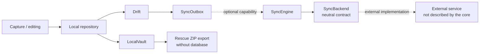
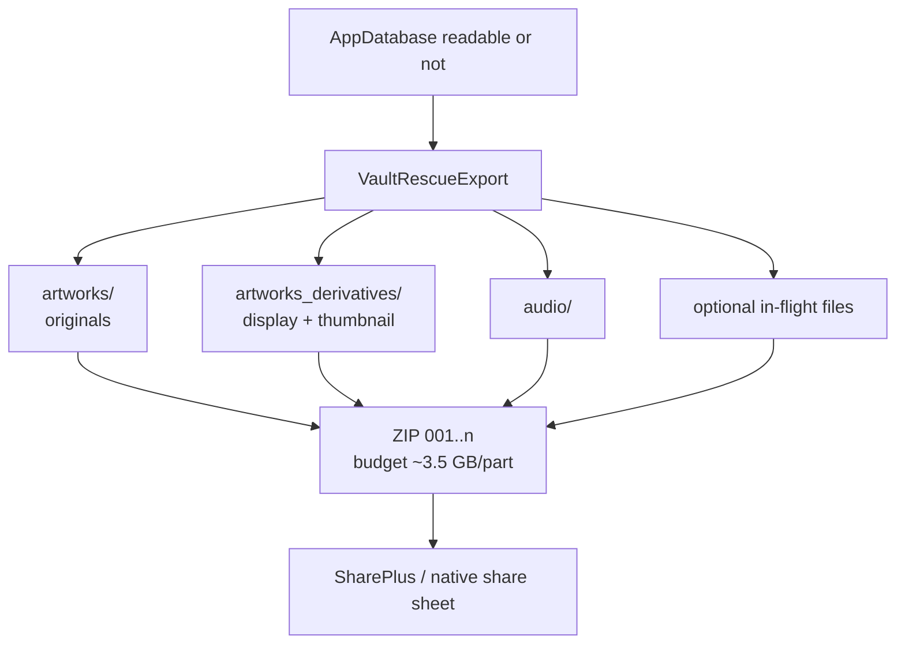
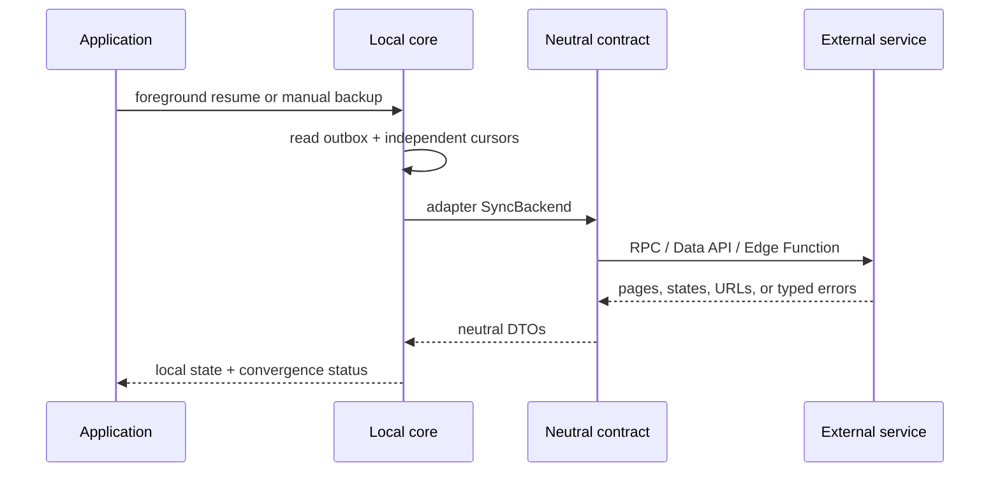

# Data flows

## Local and optional flow map



## Local creation

```text
capture or edit → local repository → Drift + LocalVault
                                     └─ success after durable write
```

Files use safe writes and failed cleanup is journaled. Active reads exclude
artwork with `deletedAt`.

## Local rescue export



The rescue archive intentionally contains technical filenames only. It is a
file recovery mechanism, not a database export or an import/synchronization
format.

## Local recovery

```text
delete → local deletedAt → trash → restore or scheduled purge
                                      └─ deferred file cleanup when needed
```

The local trash has no external scope. An application may implement a separate
shared deletion behavior behind an adapter without changing this path.

## Optional external synchronization

The core produces idempotent operations and independent cursors. An adapter may
translate them to an external protocol. It cannot be read while its
capability is disabled, and local and remote authority never silently replace
one another.


